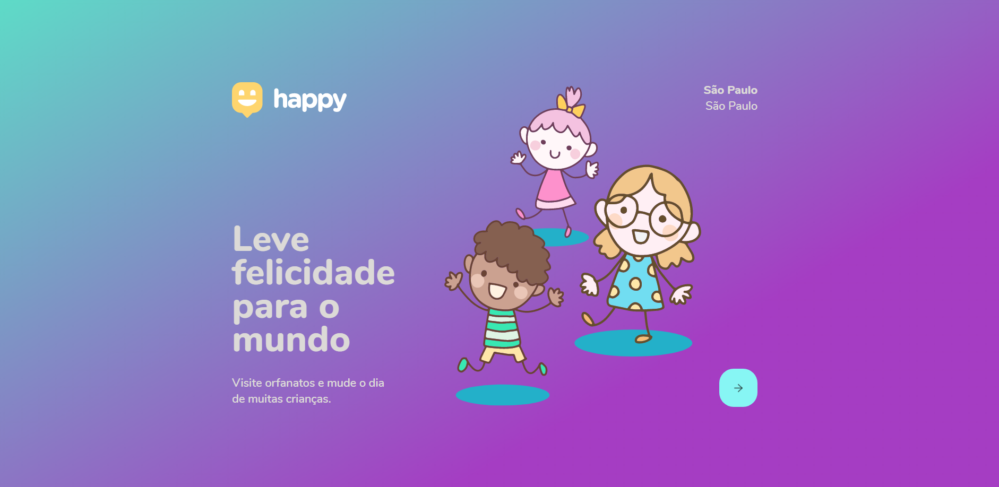

<p align="center"> NextLevelWeek 3.0 🚀</p>

<p align="center">
   
</p>

<p align="center">	
   <a href="https://www.linkedin.com/in/lorison-gilles/">
      
   </a>
  

  <a aria-label="Completed" href="https://nextlevelweek.com/episodios/omnistack/1/edicao/3">
    </img>
  </a>
  <a href="https://github.com/Gilles30/happy-nlw3-react/commits/master">
    
  </a> 
  
  <a href="https://github.com/Gilles30/happy-nlw3-react/stargazers">
    
  </a>
</p>

> <p align="center"> :rocket: Project made to connect teachers to students, made in Next Level Week #3 @Rocketseat </p>

<p align="center">
    <a href="README.md">English</a>
    ·
    <a href="README-pt.md">Portuguese</a>
 </p>

<div align="center">
  <sub>The NLW #3 project. Built with ❤︎ by
    <a href="https://github.com/Gilles30">Lorison Gilles</a> and
    <a href="https://github.com/Gilles30/happy-nlw3-react/">
      contributors
    </a>
  </sub>
</div>

# :pushpin: Table of Contents

* [Demo Website](#eyes-demo-website)   
* [Technologies](#computer-technologies)
* [Features](#rocket-features)
* [How to Run](#construction_worker-how-to-run)
* [Found a bug? Missing a specific feature?](#bug-issues)
* [Contributing](#tada-contributing)
* [License](#closed_book-license)

<h2 align="left"> 📥 Layout available for download at: </h2>
<p align="center">
    <a title="Download .fig Web" href="https://www.figma.com/file/mDEbnoojksG4w8sOxmudh3/Happy-Web/duplicate">
        
    </a>
    <a title="Download .fig Mobile" href="https://www.figma.com/file/X27FfVxAgy9f5IFa7ONlph/Happy-Mobile/duplicate">
        
    </a>
</p>

### Web Screenshot
<div>
   
</div>

### Mobile Screenshot
<div>
   <h1> Mobile development will take place between October 14th and 15th </h1>
</div>

# :eyes: Demo Website
You can acess the website at:     
👉  demo: https://happy-orphanage.vercel.app/ - https://www.youtube.com/watch?v=_zytBwnL6xE

[](https://happy-orphanage.vercel.app/)      


# :computer: Technologies
This project was made using the follow technologies:

* [Typescript](https://www.typescriptlang.org/)      
* [React](https://reactjs.org/)      
* [Expo](https://expo.io/)       
* [Express](https://expressjs.com/)      

# :rocket: Features

* Website to sign up teachers and students.
* App to connect teachers and students.

# :construction_worker: How to run
```bash
# Clone Repository
$ git clone https://github.com/Gilles30/happy-nlw3-react.git
```
### 📦 Run API

```bash
# Go to server folder
$ cd Happy/server

# Install Dependencies
$ yarn install or $ yarn 

# Create Database
$ yarn typeorm migration:run

# Run Aplication
$ yarn start
```
Access API at http://localhost:3333/

### 💻 Run Web Project

```bash
# Go to web folder
$ cd Happy/web

# Install Dependencies
$ yarn

# If there is an error, in "react-dom", perform the installation below
$ yarn add @types/react-router-dom -D
$ yarn add axios

# Run Aplication
$ yarn start
```
Go to http://localhost:3000/ to see the result.

### 📱 Run Mobile Project
To run the mobile project you need a cellphone with the app of [expo](https://play.google.com/store/apps/details?id=host.exp.exponent) instaled or a emulator android/ios.
<br />
After, fork this repository and clone to your machine. Inside of the project's folder run the following commands:

```bash
# Go to mobile folder
$ cd Happy/mobile

# Install Dependencies
$ yarn install

# Run Aplication
$ yarn start
```
Aferter read the QRCode with the app of [expo](https://play.google.com/store/apps/details?id=host.exp.exponent) or run on emulator.


# :bug: Issues

Feel free to **file a new issue** with a respective title and description on the the [Proffy](https://github.com/Gilles30/happy-nlw3-react/issues) repository. If you already found a solution to your problem, **i would love to review your pull request**!

# :tada: Contributing

Check out the [contributing](./CONTRIBUTING.md) page to see the best places to file issues, start discussions and begin contributing.

## 🤝 Contributing

Siga os passos abaixo para contribuir:

1. Faça o *fork* do projeto (<https://github.com/Gilles30/happy-nlw3-react>)

2. Clone o seu *fork* para sua maquína (`git clone https://github.com/Gilles30/happy-nlw3-react.git`)

3. Crie uma *branch* para realizar sua modificação (`git checkout -b feature/name_new_feature`)

4. Adicione suas modificações e faça o *commit* (`git commit -m "Descreva sua modificação"`)

5. *Push* (`git push origin feature/name_new_feature`)

6. Crie um novo *Pull Request*

7. Pronto, agora só aguardar a análise 🚀 

# :closed_book: License

Released in 2020 :closed_book: License

Made with love by [Lorison Gilles](https://lorison-gilles.netlify.app/) 🚀.
This project is under the [MIT license](./LICENSE).


Give a ⭐️ if this project helped you!
